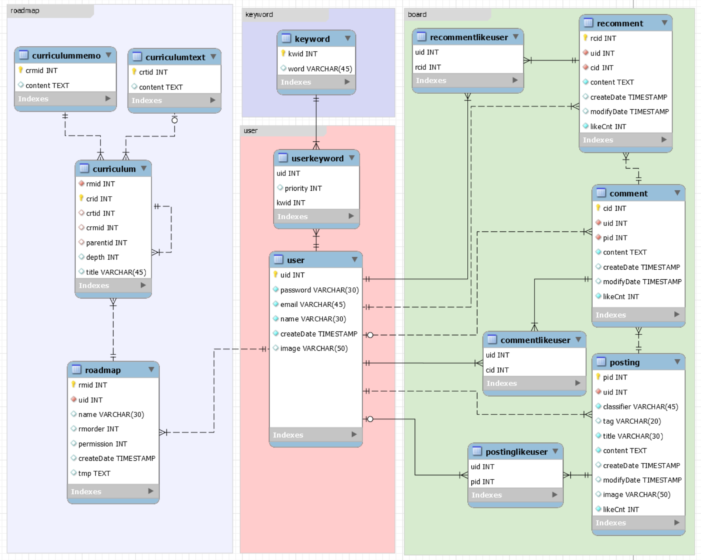
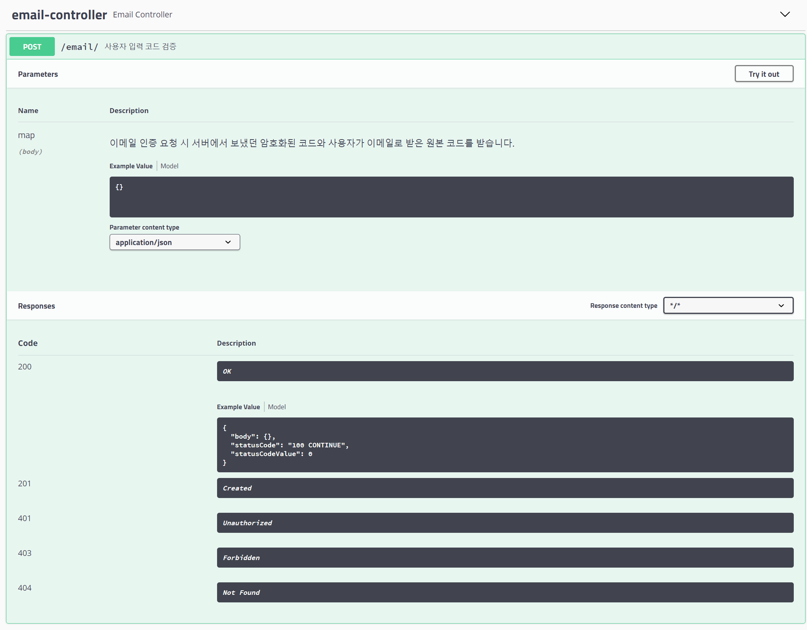
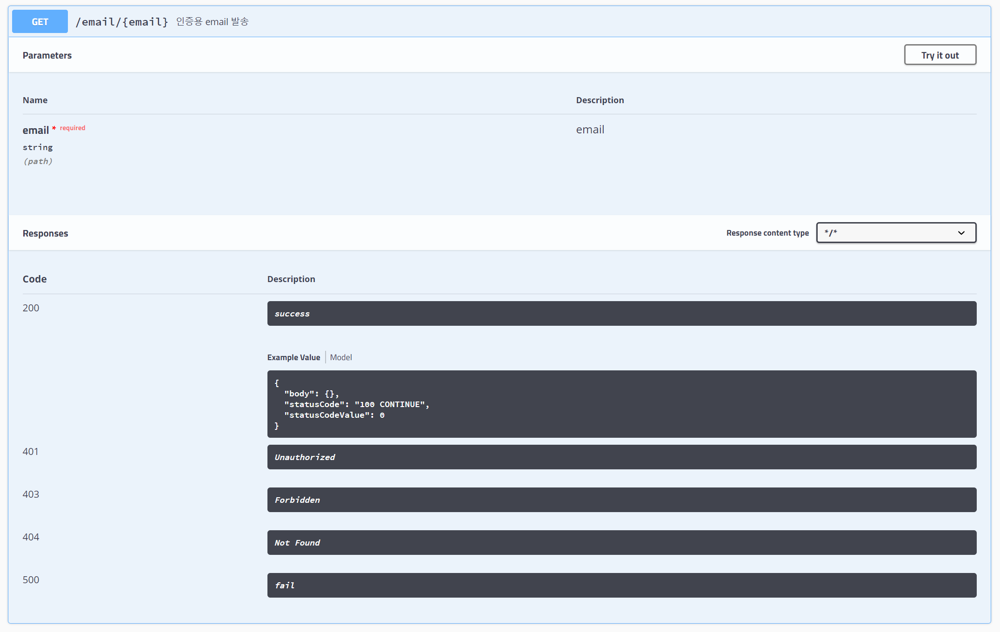
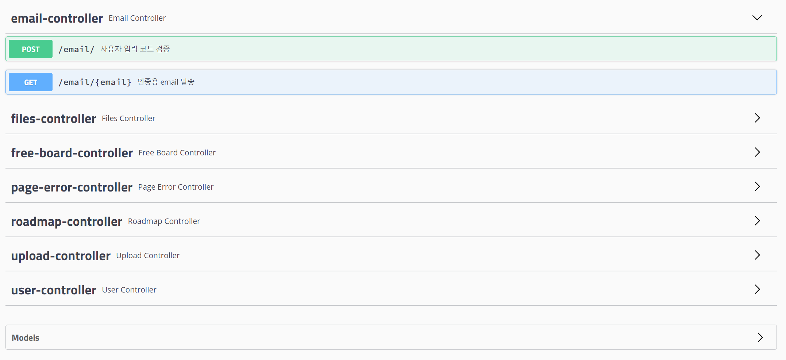

<center>
    
</center>


# SSAFY 4th 자율 프로젝트 1차 sub2

개발자를 위한 개발자 로드맵 제시 및 개인 커스터마이징 로드맵 제공 웹 페이지


## 🚀 Getting Started

### Rererequisites

- Java
- npm
- MySQL Workbench
- STS

###  Install

#### npm 설치

> 초기 위치 : 프로젝트 폴더

```
cd frontend/
npm i
```

<span style="color: red;">(주의)</span> `$ npm i`는 frontend 디렉토리에서 수행해야 합니다.


### Usage

#### Front server 구동

```
npm run serve
```

<span style="color: red;">(주의)</span> `$ npm i`는 frontend 디렉토리에서 수행해야 합니다.


#### Back server 구동

```
1. STS 실행
2. File - Import Projects from File System... 클릭
3. backend폴더를 Directory로 선택
4. Package Explorer에 있는 backend를 마우스 우클릭 후 Run As - Spring Boot App 클릭
```


#### DataBase 구동

> 실행 파일 이름 : roadwiki.sql

```
1. MySQL Workbench 실행
2. Navigator - Administration - Data Import/Restore
3. Import from Self-Contained File 클릭 후 roadwiki.sql로 파일 설정
4. Default Target Schema - New... 클릭 후 roadwiki 입력
5. Start Import 클릭
```


---


## 📂프로젝트 구조

```
sub02
├─backend
│  ├─.settings
│  └─src
│     ├─main
│     │  ├─java
│     │  │  └─com
│     │  │      └─web
│     │  │          └─blog
│     │  │              ├─config
│     │  │              ├─controller
│     │  │              ├─exception
│     │  │              ├─interceptor
│     │  │              └─model
│     │  │                  ├─dto
│     │  │                  ├─repo
│     │  │                  └─service
│     │  └─resources
│     │      ├─mapper
│     │      └─statics
│     │          └─upload
│     └─test
│         └─java
│             └─com
│                 └─web
│                     └─blog
└─frontend
   ├─public
   │  └─img
   │      ├─brand
   │      ├─icons
   │      │  ├─cards
   │      │  ├─common
   │      │  └─flags
   │      └─theme
   └─src
       ├─assets
       │  └─scss
       ├─components
       │  ├─Board
       │  ├─Login
       │  ├─Logout
       │  ├─Navbar
       │  ├─Profileupdate
       │  ├─SidebarPlugin
       │  └─Validation
       ├─directives
       ├─plugins
       ├─routes
       ├─store
       ├─util
       └─views
           ├─Board
           │  ├─Posting
           │  └─Tables
           ├─Layout
           ├─Maps
           ├─Pages
           │  └─UserProfile
           ├─Roadmap
           └─Tables
               └─RegularTables
```


---

## 🖌ERD (Entity-Relationship Diagram)




---

## ✨ Swagger

> http://localhost:8085/swagger-ui.html#/








## 📜 기능 설명

### 🎨로드맵 기능

#### 공식 로드맵 제공

- 기본적인 로드맵 제공을 통해 사용자 편의성 향상

#### 로드맵 커스터마이징 기능

- 사용자 맞춤형 로드맵 생성 및 수정 가능

---

### 👩‍💻커뮤니티

#### 게시판

- 타유저와의 소통 공간

---

### 😀유저 관리

#### 회원가입

#### 로그인

#### 로그아웃

#### 회원탈퇴


